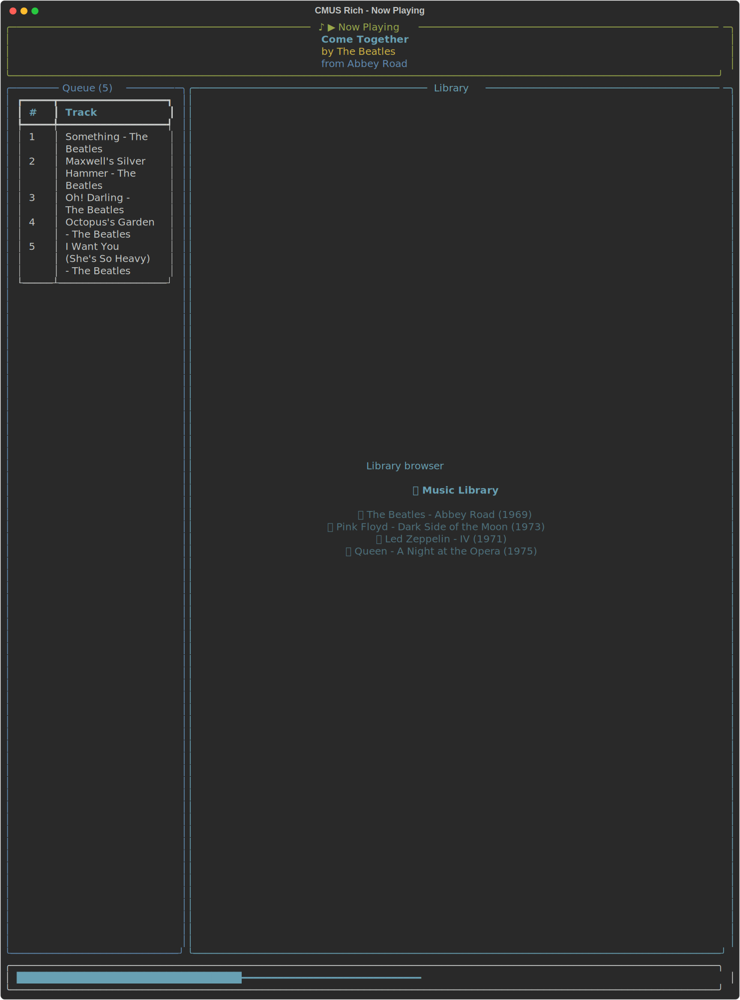
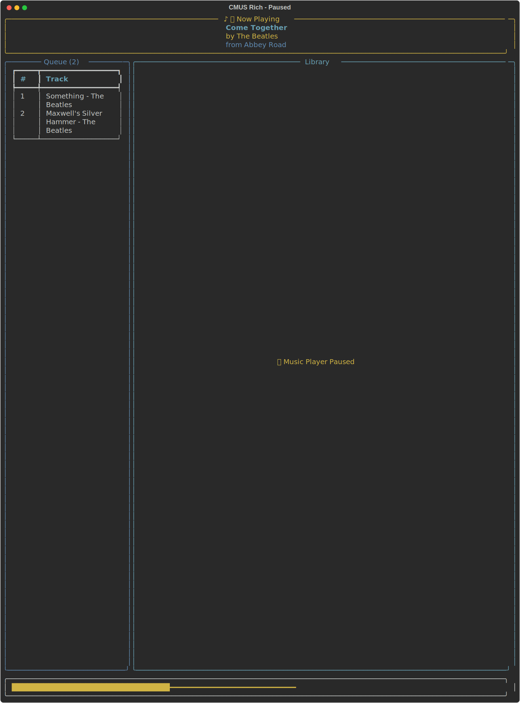
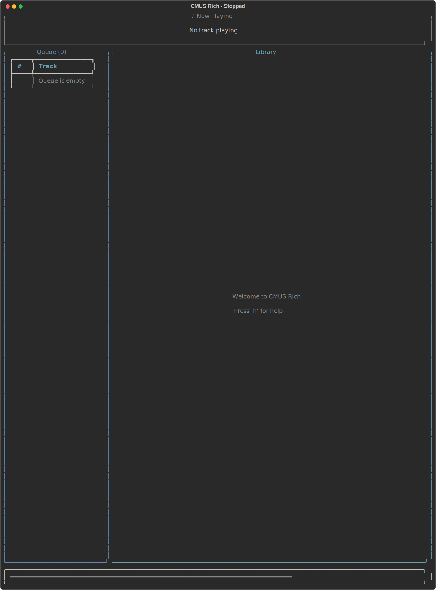

# CMUS Rich UI Screenshots

This directory contains screenshots of the CMUS Rich terminal user interface in different states.

## Screenshots

### Playing State


**File:** `dashboard_playing.svg`

Shows the UI when actively playing music with:
- Now playing widget showing track, artist, and album
- Queue with upcoming tracks
- Library browser
- Progress bar with time and volume indicators
- Shuffle indicator

---

### Paused State


**File:** `dashboard_paused.svg`

Shows the UI when playback is paused with:
- Yellow border indicating paused state
- Pause icon (⏸) in the header
- Current track information preserved
- Queue still visible

---

### Stopped State


**File:** `dashboard_stopped.svg`

Shows the UI when no music is playing with:
- "No track playing" message
- Empty queue
- Welcome message in the main content area
- Minimal progress bar

---

## Generating Screenshots

Screenshots are generated using the `demo_ui.py` script in the root directory:

```bash
python demo_ui.py
```

This will create/update all three SVG screenshots showing different states of the player.

## Viewing Screenshots

SVG files can be viewed in:
- Web browsers (Chrome, Firefox, Safari, Edge)
- Image viewers that support SVG (many modern ones do)
- GitHub directly (when viewing this directory on GitHub)
- Text editors with SVG preview support (VS Code, etc.)

## Technical Details

- **Format:** SVG (Scalable Vector Graphics)
- **Generator:** Rich library's console.save_svg()
- **Width:** 120 characters
- **Color:** Full terminal color support
- **Font:** Monospace (terminal font)

These screenshots demonstrate the clean, modern terminal UI powered by the [Rich](https://github.com/Textualize/rich) library.
